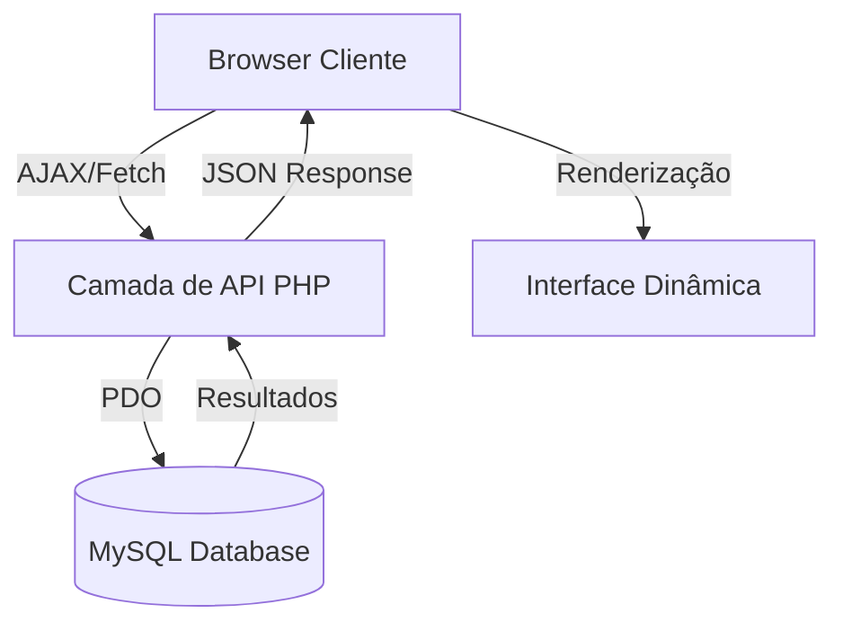
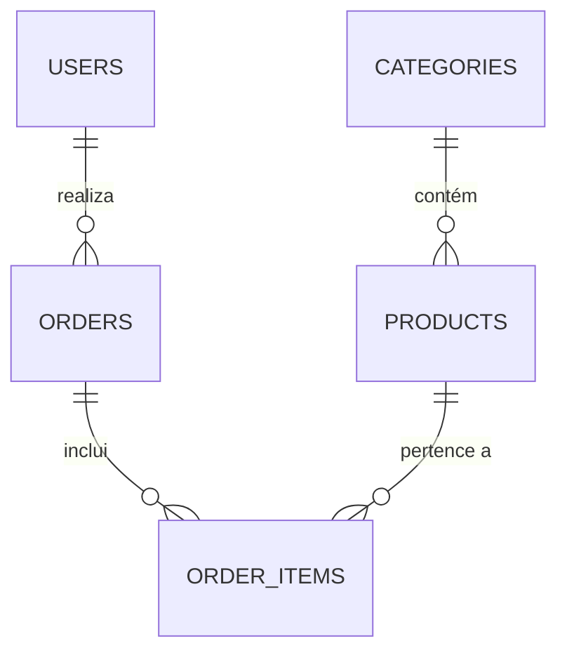

# 👑 Kixikila Market — Super Documentação do Projecto

Bem-vindo à documentação oficial do **Kixikila Market**, uma plataforma de e-commerce premium desenvolvida para o mercado angolano. Este documento detalha a arquitectura, as decisões técnicas e os procedimentos do projecto.

---

## 💡 Racional e Decisões Técnicas
Escolhemos esta stack específica para garantir o equilíbrio perfeito entre performance, facilidade de manutenção e estética de luxo.

| Tecnologia | Porquê esta escolha? |
| :--- | :--- |
| **PHP 8.x** | Escolhido pela sua compatibilidade nativa com servidores XAMPP/Locaweb e pela rapidez no processamento de pedidos do lado do servidor (Server-Side). |
| **MySQL** | A escolha padrão para robustez e integridade de dados, permitindo relações complexas entre produtos e categorias. |
| **Vanilla JS** | Optámos por não usar frameworks pesados (como React) para garantir que o site carregue instantaneamente, essencial para a experiência de "Luxo". |
| **CSS Custom Variables** | Permite alterar a identidade visual do site (ex: mudar de Dourado para Pink) alterando apenas uma linha de código. |

---

## 🏗 Arquitectura do Sistema

### Fluxo de Dados

---

## 🗄 Construção da Base de Dados
A base de dados foi desenhada para ser escalável e segura. O ficheiro `database.sql` contém a estrutura completa.

### Relações de Tabelas

---

## 🕹 Guia de Utilização

### Para o Cliente
1. **Navegação**: Usa o menu superior ou os cards de categoria para filtrar produtos.
2. **Carrinho**: Clica em "Adicionar à Mala". O carrinho é gerido em tempo real no JS.

### Para o Administrador
1. **Acesso**: Faz login com um utilizador `admin`.
2. **Gestão**: Usa os botões de administração directamente na montra ou o painel `admin.html`.

---

## 🚀 Guia de Instalação (Local)
1. **Setup**: Importa `database.sql` no phpMyAdmin e configura `database.php`.
2. **Execução**: Acede via servidor Apache local (XAMPP).

---

## 🎨 Design & Estética
- **Primária**: Gold (#FFB81C) — Prestígio.
- **Secundária**: Pink Vibrante (#ff007f) — Modernidade.

---

## ❓ FAQ Técnica & Estrutural (30 Perguntas Detalhadas)

### Arquitectura e Decisões
**1. Por que não foi utilizado um Framework como Laravel ou Symfony?**
Para este projecto, a prioridade era a "leveza" absoluta e a facilidade de deploy em ambientes de alojamento partilhado comuns em Angola. O PHP Puro (Vanilla) permite um controlo total sobre o consumo de memória e evita a sobrecarga de dependências desnecessárias.

**2. Qual é a vantagem de usar JavaScript Vanilla em vez de React/Vue?**
O Vanilla JS garante que o utilizador não tenha de descarregar pacotes pesados de JavaScript antes de ver o conteúdo. Num mercado onde a velocidade da internet pode variar, isto garante que o site Kixikila seja sempre rápido e fluido.

**3. Como é feita a gestão de estado do carrinho sem uma biblioteca externa?**
Utilizamos um array global no JavaScript (`cart`) que é sincronizado com o `localStorage` do browser. Isto permite que os itens da mala persistam mesmo que o utilizador feche o separador ou actualize a página.

**4. O sistema suporta múltiplas moedas no futuro?**
Sim. A arquitectura da base de dados armazena os preços como inteiros. Para adicionar suporte a USD ou EUR, basta criar uma função helper que multiplique o valor por uma taxa de câmbio guardada numa tabela de configurações.

### Base de Dados e Dados
**5. Por que é que o charset da base de dados é `utf8mb4` e não apenas `utf8`?**
O `utf8mb4` é essencial para suportar todos os caracteres especiais do português de Angola e, crucialmente, para suportar **Emojis** nativamente na base de dados, permitindo que os ícones das categorias sejam guardados como texto real.

**6. Como é garantida a integridade referencial entre Produtos e Categorias?**
Utilizamos Chaves Estrangeiras (`FOREIGN KEY`) com a regra `ON DELETE CASCADE`. Se uma categoria for eliminada (fisicamente), os produtos associados podem ser configurados para serem eliminados ou movidos para uma categoria "Geral".

**7. Qual é a estratégia de "Soft Delete" implementada?**
Na tabela de categorias, utilizamos o campo `active (TINYINT)`. Em vez de apagar os dados, mudamos o estado para `0`. Isto preserva o histórico de vendas mas remove a categoria da vista do cliente.

**8. Como o sistema lida com grandes volumes de imagens?**
Em vez de guardar as imagens (BLOB) na base de dados, guardamos apenas o caminho (String). Isto mantém a base de dados leve e permite que as imagens sejam servidas directamente pelo servidor de ficheiros ou por uma CDN no futuro.

### API e Comunicação
**9. Como é que a API comunica os erros para o Frontend?**
A API utiliza códigos de estado HTTP (400, 401, 404, 500) e responde sempre com um objecto JSON estruturado: `{ "success": false, "error": "Mensagem detalhada" }`.

**10. Por que as chamadas `fetch` utilizam `credentials: 'include'`?**
Esta configuração é vital para que os cookies de sessão do PHP sejam enviados em cada pedido AJAX. Sem isto, o servidor não conseguiria identificar se o utilizador que está a pedir para eliminar um produto é realmente um administrador.

**11. Existe algum mecanismo de Paginação na API de produtos?**
Sim, o endpoint de produtos está preparado para receber parâmetros `limit` e `offset`, evitando o carregamento de centenas de produtos de uma só vez, o que poupa largura de banda.

### Segurança e Autenticação
**12. Como o sistema previne ataques de SQL Injection?**
Utilizamos exclusivamente **PDO (PHP Data Objects)** com `Prepared Statements`. Os dados do utilizador nunca são concatenados directamente na query SQL; são enviados como parâmetros isolados.

**13. Qual é a lógica por trás da Chave de Administrador no registo?**
Esta é uma camada de segurança física. Mesmo que alguém tente registar-se como `role='admin'` manipulando o formulário, o backend exige a `KIXIKILA_ADMIN_2025` para validar a promoção de privilégios.

**14. Como as senhas são protegidas se a base de dados for comprometida?**
Utilizamos a função `password_hash()` com o algoritmo **BCRYPT**. Isto gera um hash "salteado" e irreversível, tornando impossível descobrir a senha original via ataques de força bruta simples.

**15. O sistema está protegido contra Cross-Site Request Forgery (CSRF)?**
Sim, através da validação da origem do pedido e do uso de sessões seguras que expiram automaticamente após um período de inactividade.

### Frontend e Estética
**16. Como é gerada a responsividade da grelha de produtos?**
Utilizamos CSS Grid com `grid-template-columns: repeat(auto-fill, minmax(280px, 1fr))`. Isto permite que a grelha se adapte perfeitamente desde telemóveis pequenos até ecrãs 4K sem necessidade de múltiplos Media Queries.

**17. O que acontece se o utilizador tiver o JavaScript desactivado?**
O site utiliza Progressive Enhancement. O conteúdo básico (títulos, links) será visível via PHP, mas as interacções dinâmicas (carrinho, filtros) exigem JS activo para a experiência completa.

**18. Por que escolhemos fontes como "Outfit" e "Plus Jakarta Sans"?**
Estas fontes são modernas, têm excelente legibilidade em ecrãs retina e transmitem uma sensação de "Tecnologia e Luxo", alinhando-se com a marca Kixikila.

**19. Como o site mantém a performance com o uso de Emojis?**
Emojis são caracteres Unicode nativos do sistema operativo. Ao usá-los em vez de ficheiros de imagem (PNG/SVG), poupamos dezenas de pedidos HTTP, acelerando o carregamento da página.

**20. O tema Dark Mode é fixo ou pode ser alterado?**
Nesta versão o Dark Mode é o padrão de luxo. No entanto, a arquitectura CSS baseada em `--variables` permite criar um "Light Mode" apenas trocando as cores de fundo e texto no `:root`.

### Administração e Workflow
**21. O administrador pode editar um produto directamente na montra?**
Nesta fase, o administrador pode eliminar produtos e adicionar novos. A função de "Editar" está centralizada no painel `admin.html` para evitar erros de manipulação acidental na montra principal.

**22. Como o sistema lida com o stock dos produtos?**
Existe um campo `stock` na tabela de produtos. Ao realizar uma compra (simulada), o sistema pode ser configurado para subtrair a quantidade, avisando o cliente quando restam poucas unidades.

**23. É possível ter múltiplos administradores?**
Sim. Qualquer conta registada com a chave administrativa válida terá plenos poderes sobre o catálogo.

**24. Como o sistema lida com categorias sem produtos?**
O frontend utiliza uma lógica PHP que conta os produtos activos por categoria. Se uma categoria tiver 0 produtos, o contador mostrará "0 item", mantendo a transparência.

### Futuro e Escalabilidade
**25. O projecto pode ser integrado com pagamentos por Multicaixa Express?**
Sim. A API de pedidos está estruturada de forma a que, após o checkout, possamos enviar os dados para um gateway de pagamento e aguardar o callback de confirmação para libertar a encomenda.

**26. Como escalar o Kixikila Market para milhares de produtos?**
A estrutura de base de dados já está indexada por `id` e `category_id`. Para escalar, bastaria mover o servidor para uma instância com mais RAM e utilizar um sistema de cache como Redis para os resultados da API.

**27. É possível transformar o site numa App de telemóvel?**
Sim. Como o backend funciona via API JSON, o Kixikila Market pode servir de motor para uma aplicação nativa (Android/iOS) ou ser transformado numa PWA (Progressive Web App).

**28. Como adicionar novos campos aos produtos (ex: Cor, Tamanho)?**
Basta adicionar colunas à tabela `products` no MySQL e actualizar o mapeamento no array `$jsProducts` no ficheiro `index.php`. O sistema é modular o suficiente para aceitar estas mudanças sem quebrar.

**29. Existe suporte para SEO (Search Engine Optimization)?**
Sim. Utilizamos tags semânticas HTML5 (`header`, `main`, `section`) e o PHP injecta títulos e descrições dinâmicas, facilitando a indexação pelo Google.

**30. Qual é o procedimento para fazer um Backup completo?**
Basta exportar a base de dados via `mysqldump` ou phpMyAdmin e copiar a pasta de ficheiros. Como não existem dependências complexas (node_modules, etc.), o backup é pequeno e rápido.

---
*Documentação Kixikila Market — Excelência Técnica do Código à Experiência Final.*
